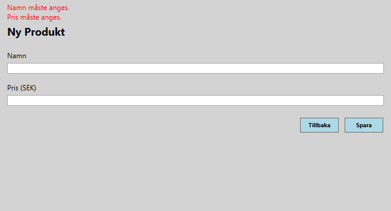

# Product Management – WPF Application
Sammanfattning
Detta projekt är en WPF-applikation för produkt­hantering, utvecklad i C# och .NET som en del av min utbildning till Webbutvecklare .NET.
Applikationen är uppbyggd enligt MVVM och en tydligt lagerindelad arkitektur, med fokus på struktur, testbarhet och tydlig ansvarsfördelning mellan lager.

## Funktionalitet
- Skapa, redigera, ta bort och lista produkter (CRUD)
- Produkter har koppling till Category och Manufacturer
- Validering av indata och dubblettkontroller
- Navigering mellan vyer (produktlista, skapa, redigera)
- Persistens till JSON-filer
  
## Screenshots
### Product list

### Add product

### Edit product

## Arkitektur (översikt)
- Projektet är uppdelat i följande lager:
- Domain – Domänentiteter, interfaces och gemensam logik
- ApplicationLayer – Applikationstjänster, DTO:er och affärslogik
- Infrastructure – JSON-baserad repository-implementation
- Presentation – WPF-vyer, ViewModels och navigation (MVVM)

Applikationen använder Dependency Injection via Generic Host, och ViewModels får sina beroenden injicerade via DI.

## Asynkronitet & robusthet
- Asynkrona operationer med stöd för CancellationToken
- Kontrollerad laddning av data för att undvika inkonsekventa UI-tillstånd
- Enhetlig hantering av resultat och fel via gemensamma result-objekt

## Tester
Projektet innehåller enhetstester skrivna med xUnit och Moq, med fokus på affärslogik i applikationslagret. Repository-beroenden mockas för att möjliggöra isolerade tester.

## Teknik
- C#
- .NET
- WPF
- MVVM
- xUnit
- Git & GitHub
